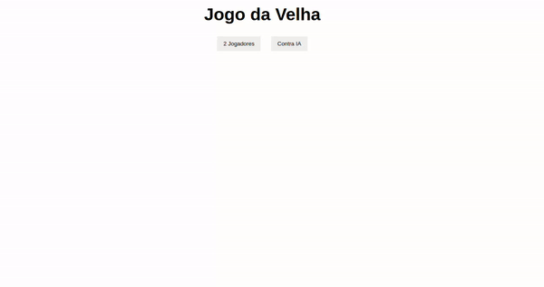

# JogoDaVelha

## Descrição do Projeto
---

    Criação de um jogo da velha utilizando as tecnologias HTML, CSS e JavaScript. 

  

## Preview do Projeto
---

 

<a href="https://danilojpfreitas.github.io/JogoDaVelha/" target="_blank"> Link para visualização do Projeto Jogo da Velha</a>

## Tecnologias Utilizadas
---
<ul>
    <li>HTML</li>
    <li>CSS</li>
    <li>JavaScript</li>
</ul>

## Redes Sociais
---
<ul>
    <li><a href="https://linkedin.com/in/danilo-freitas-dev" target="_blank">LinkedIn</a></li>
    <li><a href="https://github.com/danilojpfreitas" target="_blank">GitHub</a></li>
    <li><a href="https://danilojpfreitas.github.io/MinhaPagina/" target="_blank">Portfólio</a></li>
</ul>

---

<scan>by Danilo Freitas</scan>
